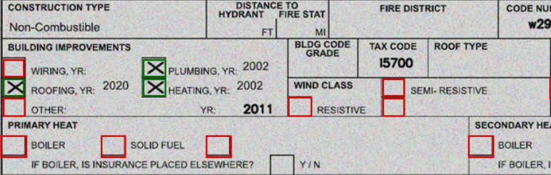

- [Introduction](#introduction)
- [Requirements](#requirements)
- [Approch](#approch)
  - [Check Box detection](#check-box-detection)
  - [Check Box Classification](#check-box-classification)
- [Results](#results)
  - [Classification results](#classification-results)
- [Evaluation](#evaluation)
  - [Detection Results:](#detection-results)
  - [Detection Results:](#detection-results-1)

## Introduction

When Processing Documets of like forms and statements, information present could be of various types. Checkbox items, One such type, are found commonly in the forms/douments. identifying checkboxes and whether a check box is selected or not forms vital part of information extraction. This project outlines a simple approch for processing checkboxes and extracting information from them. The idea of the project is let users use this as ready to go for similar usecase without or with little modifications.         

## Requirements

## Approch
The classification check invlves 2 steps
1. Check box Detection
2. Classification
   
### Check Box detection
 For this task, an open source project "BoxDetect" based on OpenCV which allows us to easily detect rectangular shapes like characters or checkbox boxes on scanned forms can be used. For more detail follow the github page.

 https://github.com/karolzak/boxdetect 

### Check Box Classification
For the classification of checkboxes value we have built a shallow CNN model and was trained on public data consisting of classes selected, not selected, and not a checkbox. Checkbox coordinates we get from the Detection step are used to crop the images and then, fed into the CNN model to get predictions.

[CheckBox_Classification.ipynb](CheckBox_Classification.ipynb)  notebook contains codes implementation of the above steps  

## Results


### Classification results
```
Model validation results:
              precision        recall  f1-score   support

           not_a_checkbox       1.00      0.98      0.99        50
           not_selected         0.99      1.00      1.00      1172
           selected             0.99      0.99      0.99       407

    accuracy                           0.99      1629
   macro avg       1.00      0.99      0.99      1629
weighted avg       0.99      0.99      0.99      1629
```


## Evaluation

### Detection Results:
 | 
 | 

### Detection Results:
<span style="color:green;font-weight:1000;">------</span> - selected
<span style="color:red;font-weight:1000;">------</span> - Not selected

 | 
 | 

