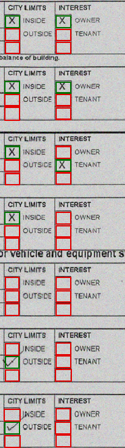

# Check Box Detection and Classification
[](#)
  - [Introduction](#introduction)
  - [Requirements](#requirements)
  - [Approch](#approch)
    - [Check Box detection](#check-box-detection)
    - [Check Box Classification](#check-box-classification)
  - [Results](#results)
    - [Classification results](#classification-results)
  - [Evaluation](#evaluation)
    - [Detection Results:](#detection-results)
    - [Detection Results:](#detection-results-1)

## Introduction

When processing documents such as forms and statements, a range of information can be encountered. Among these, checkbox items are commonly found in various forms and documents. Identifying these checkboxes and determining their selection status is crucial for extracting information. In this project, an approach is introduced to extract information from checkboxes. The aim is to provide a readily usable solution for similar scenarios with minimal adjustments.       

## Requirements

## Approach
The classification check involves 2 steps
1. Check box Detection
2. Classification
   
### Check Box detection
In order to achieve this objective, we can utilize "BoxDetect," an open source project that relies on OpenCV. This project is designed to identify rectangular shapes such as characters or checkboxes on scanned forms. For additional information, please refer to the GitHub page.

 https://github.com/karolzak/boxdetect

### Check Box Classification
We developed a shallow CNN model to categorize checkbox values, which underwent training on publicly available data encompassing three classes: selected, unselected, and non-checkboxes. Once the detection phase is complete, the checkbox coordinates are employed to extract and feed images into the CNN model for prediction purposes.

[CheckBox_Classification.ipynb](CheckBox_Classification.ipynb)  includes codes for implementing the above steps.  

## Results


### Classification results
```
Model validation results:
              precision        recall  f1-score   support

           not_a_checkbox       1.00      0.98      0.99        50
           not_selected         0.99      1.00      1.00      1172
           selected             0.99      0.99      0.99       407

    accuracy                           0.99      1629
   macro avg       1.00      0.99      0.99      1629
weighted avg       0.99      0.99      0.99      1629
```


## Evaluation

### Detection Results:
 | 
 | 

### Classification Results:
-  `selected`
-  `Not selected`

 | 
 | 


