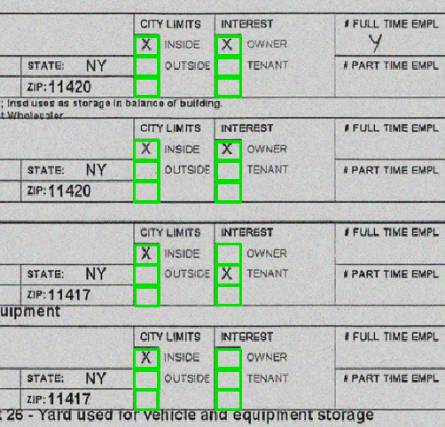

# Check Box Detection and Classification
- [](#)
  - [Introduction](#introduction)
  - [Requirements](#requirements)
  - [Approch](#approch)
    - [Check Box detection](#check-box-detection)
    - [Check Box Classification](#check-box-classification)
  - [Results](#results)
    - [Classification results](#classification-results)
  - [Evaluation](#evaluation)
    - [Detection Results:](#detection-results)
    - [Detection Results:](#detection-results-1)

## Introduction

Various types of information can be present when processing documents like forms and statements. The checkbox items, one type of item, are found in many forms and documents. A vital part of information extraction is identifying checkboxes and determining whether they are selected or not. An approach is presented for extracting information from checkboxes in this project. This project is designed to be used as a ready-to-go solution for similar use cases with minimal modifications.         

## Requirements

## Approach
The classification check involves 2 steps
1. Check box Detection
2. Classification
   
### Check Box detection
 To accomplish this task, we can use an open source project "BoxDetect" based on OpenCV, which detects rectangular shapes such as characters or checkboxes on scanned forms. Visit the GitHub page for more details.

 https://github.com/karolzak/boxdetect 

### Check Box Classification
To classify checkbox values, we built a shallow CNN model that was trained on public data consisting of classes selected, unselected, and not checkboxes. After the detection step, the checkbox coordinates are used to crop images and then fed into the CNN model to make predictions.

[CheckBox_Classification.ipynb](CheckBox_Classification.ipynb)  includes codes for implementing the above steps.  

## Results


### Classification results
```
Model validation results:
              precision        recall  f1-score   support

           not_a_checkbox       1.00      0.98      0.99        50
           not_selected         0.99      1.00      1.00      1172
           selected             0.99      0.99      0.99       407

    accuracy                           0.99      1629
   macro avg       1.00      0.99      0.99      1629
weighted avg       0.99      0.99      0.99      1629
```


## Evaluation

### Detection Results:
 | 
 | 

### Detection Results:
-  `selected`
-  `Not selected`

 | 
 | 


